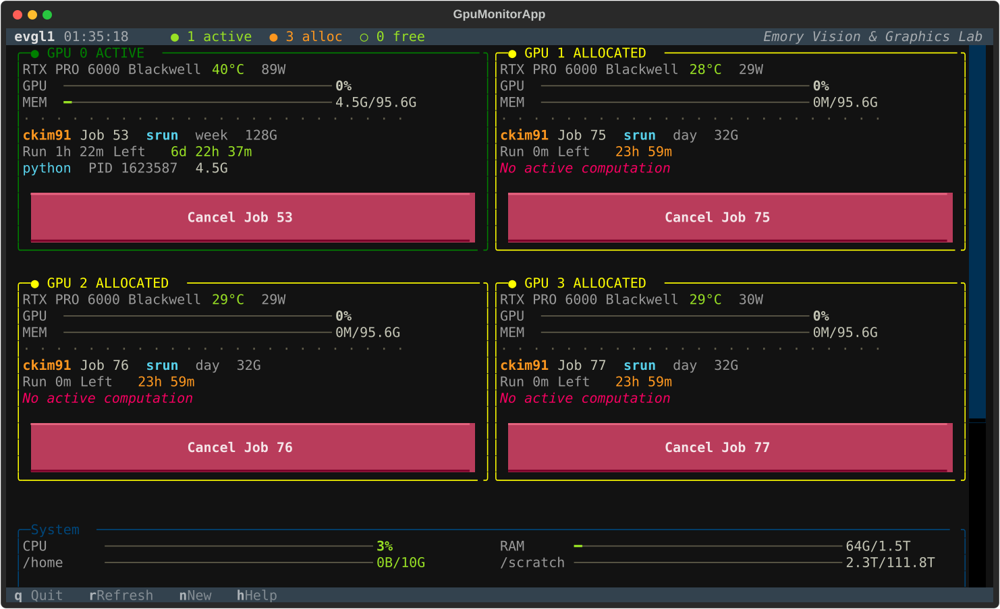
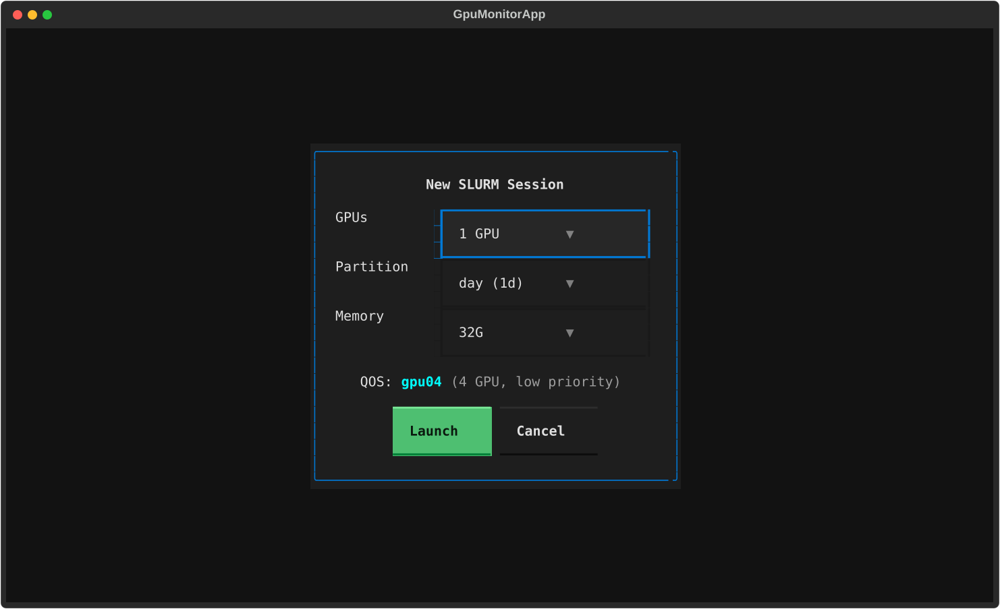
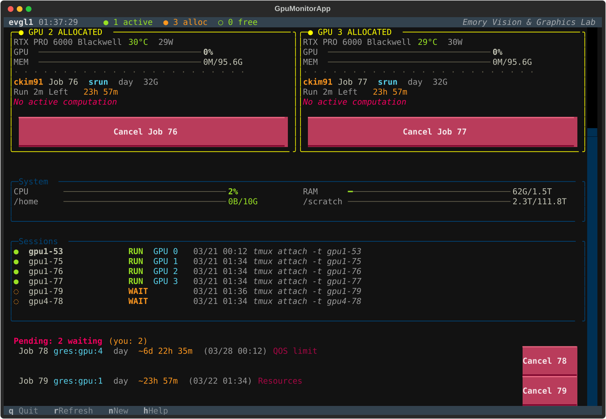
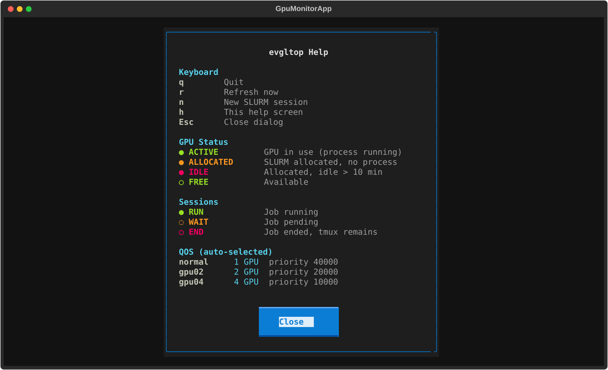

<p align="center">
  
</p>

<p align="center">
  <strong>See your GPUs. Know who's on them. Grab one in seconds.</strong>
</p>

<p align="center">
  
  
  
  
</p>

<p align="center">
  
</p>

---

## The Problem

You SSH into the lab server. You need a GPU. You run `nvidia-smi`. All 4 GPUs are taken. But by who? Are they actually using them? When will one free up? You run `squeue`. You cross-reference job IDs. You check tmux sessions. You piece it together manually.

**evgltop does all of this in one screen, updated every second.**

## Install

```bash
pip install evgltop
```

Then just run:

```bash
evgltop
```

That's it. No config, no setup, no root access.

- See all 4 GPUs at a glance with live utilization bars
- See exactly who is running what process on each GPU
- Press `n` to launch a new SLURM session with auto-optimized QOS
- Click `Cancel` to kill a job (and optionally its tmux session)
- Watch the pending queue with estimated wait times

---

## Screenshots

### GPU Dashboard + System Resources

Every GPU card shows: utilization, VRAM, temperature, power, the user, their SLURM job, runtime, and remaining time. Below: CPU, RAM, disk usage, and your tmux sessions.

<p align="center">
  
</p>

### One-Click Session Launch

Press `n`. Pick GPUs, partition, memory. evgltop auto-selects the best QOS so your job starts as fast as possible.

<p align="center">
  
</p>

### Pending Queue with Wait Time Estimates

All GPUs taken? evgltop shows your pending jobs with estimated start times. Even when SLURM says `N/A`, evgltop calculates it from running jobs' remaining time — and chains estimates across multiple pending jobs.

<p align="center">
  
</p>

### Built-In Help

Press `h` for a quick reference of everything.

<p align="center">
  
</p>

---

## Feature Highlights

### GPU Waste Detection

If someone allocated a GPU but isn't using it (0% utilization for >10 min), the card turns **red** with `IDLE` status. Hard to ignore.

### Smart QOS

SLURM QOS tiers have different GPU limits and priorities. evgltop checks what you're already using and picks the tier that maximizes your throughput:

```
Request 1 GPU:
  normal slot free?  -> normal  (priority 40000, fastest)
  normal full?       -> gpu02   (priority 20000)

Request 2 GPUs:      -> gpu02
Request 3-4 GPUs:    -> gpu04   (priority 10000)
```

No more `QOSMaxGRESPerUser` surprises.

### Pending Queue with Time Estimates

SLURM says `N/A` for your pending job's start time? evgltop calculates it by looking at when running jobs will end, then chains the estimates if you have multiple pending jobs.

```
Job 64  gres:gpu:4  ~6d 23h (03/28 00:12)  QOS limit
Job 66  gres:gpu:4  ~7d 23h (03/29 00:12)  QOS limit   <- accounts for Job 64's runtime
```

### Tmux Session Tracking

Sessions auto-named `gpu{N}-{JOBID}`. The Sessions panel shows which are running, waiting, or ended:

```
● gpu1-53    RUN  GPU 0  03/21 00:12   tmux attach -t gpu1-53
◌ gpu4-67    WAIT        03/21 00:36   tmux attach -t gpu4-67
○ gpu2-70    END         03/21 01:02   tmux attach -t gpu2-70
```

---

## Keybindings

| Key | Action |
|-----|--------|
| `n` | New SLURM session |
| `h` | Help |
| `r` | Force refresh |
| `q` | Quit |
| `Esc` | Close dialog |
| Click `Cancel` | Cancel a running/pending job |

---

## Requirements

- Python 3.10+
- NVIDIA GPUs with `nvidia-smi`
- SLURM (`squeue`, `scontrol`, `scancel`)
- `tmux`

---

<p align="center">
  <b>Emory Vision & Graphics Lab</b>
</p>
